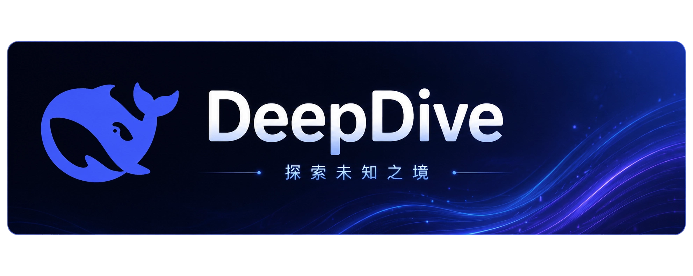
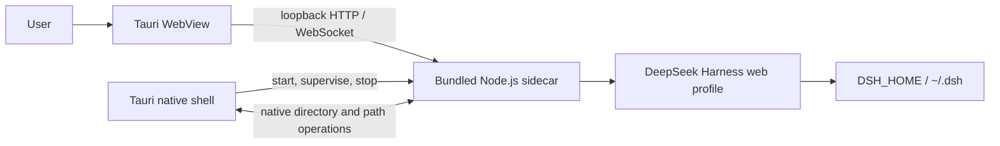

<p align="center">
  
</p>

<p align="center"><strong>Bring DeepSeek Harness to the desktop: install directly, keep one configuration and data model, and skip Node.js setup.</strong></p>

<p align="center">
  <a href="https://github.com/cipherTing/deepseek-harness-desktop-pure/releases/latest"><strong>Download latest</strong></a>
  · <a href="https://github.com/deepseek-ai/deepseek-harness">View upstream</a>
  · <a href="https://github.com/cipherTing/deepseek-harness-desktop-pure/issues">Report an issue</a>
</p>

<p align="center">
  <a href="https://github.com/cipherTing/deepseek-harness-desktop-pure/releases/latest"></a>
  <a href="https://github.com/cipherTing/deepseek-harness-desktop-pure/actions/workflows/build-desktop.yml"></a>
  <a href="LICENSE"></a>
  
</p>

<p align="center"><a href="README.md">简体中文</a> · English</p>

<p align="center"><sub>DeepDive was formerly DeepSeek Harness Desktop. It was renamed for brand and trademark clarity to avoid confusion with the DeepSeek Harness name and brand. DeepDive is an independent distribution and is not affiliated with or endorsed by DeepSeek.</sub></p>

> **Project boundary: this project does exactly one thing, package the DeepSeek Harness Web client as a clean Desktop distribution.** It does not add Harness features, change business logic, maintain a second configuration or data model, or introduce a separate "Desktop mode" into DeepSeek Harness.

## Project scope

[DeepSeek Harness](https://github.com/deepseek-ai/deepseek-harness) is the only source of Harness product functionality. This repository is an independent desktop-distribution fork responsible only for the Tauri shell, bundled runtime, required Desktop system adapters, and macOS/Windows packages.

| Principle | Meaning |
| --- | --- |
| **Clean packaging** | Preserve the DeepSeek Harness Web UI, APIs, event streams, dynamic plugins, and Harness runtime semantics instead of copying or rewriting Web functionality. |
| **No runtime setup** | Release packages include Node.js and the Harness production dependency closure; users do not install Node.js, pnpm, Rust, or another development environment. |
| **One data model** | Desktop and native Web use the same `DSH_HOME`, `~/.dsh`, `.env` loading rules, settings, credentials, sessions, workspaces, and caches. |
| **Extremely low intrusion** | Desktop integration stays under `desktop/` whenever possible; original-project code changes are allowed only for a concrete Tauri blocker and must remain minimal. |
| **Independent distribution** | Desktop has its own SemVer releases, while the synchronized original-project revision is recorded separately. |

## Download and install

Download the latest package for your platform from [GitHub Releases](https://github.com/cipherTing/deepseek-harness-desktop-pure/releases/latest). Once installed, launch the application directly; no Node.js or package-manager setup is required.

| Platform | Package | Support |
| --- | --- | --- |
| macOS | `deepdive-macos-arm64-<version>.dmg` | macOS 11 or newer, Apple Silicon only. |
| Windows | `deepdive-windows-x64-<version>.exe` | Windows x64 using the system Evergreen WebView2 Runtime; the installer downloads it only when missing. |

> **Installation note:** Current macOS packages use ad-hoc signing and are not Apple-notarized. Windows packages do not use a purchased commercial code-signing certificate. The operating system may therefore show a developer or SmartScreen warning on first install; confirm that the package came from this repository's GitHub Release.

## Runtime architecture

Desktop does not rewrite the Harness backend in Rust or reimplement browser transport. Tauri starts the bundled Node.js sidecar, which boots the standard `web` profile on a random `127.0.0.1` port. The system WebView loads that address directly. The listener is bound only to the local loopback interface and is not exposed to the LAN or public network.



The DeepSeek Harness Web Host remains responsible for the index document, client-plugin bundles, `/api`, event streams, and dynamic-plugin updates. Desktop owns only the native window, process lifecycle, distribution, and required operating-system interactions.

## Configuration and data compatibility

- An existing `DSH_HOME` is inherited unchanged; otherwise Harness continues to resolve it as `~/.dsh`.
- `.env` files follow the existing Harness loading order; Desktop does not introduce a separate environment file.
- The sidecar starts with the operating-system user home as its working directory, never the Tauri install, resource, or application-data directory.
- Desktop and native Web can read the same settings, credentials, profiles, sessions, workspaces, and caches.
- Bundled Node.js, JavaScript dependencies, and Tauri resources are runtime files only and are never mixed with Harness user data.

## Native Web and DeepSeek Harness source

### Run

To start the native Web client directly, follow the [DeepSeek Harness project run instructions](https://github.com/deepseek-ai/deepseek-harness#run). Desktop neither replaces nor changes that path.

### Run from source

To develop Harness itself or launch from the DeepSeek Harness source, follow the [DeepSeek Harness project source instructions](https://github.com/deepseek-ai/deepseek-harness#run-from-source). This repository adds only the Desktop packaging layer on top.

## Local development

The repository keeps the DeepSeek Harness project development workflow and adds two root-level Desktop commands. Desktop CI and release packaging pin Node.js `22.23.2`, pnpm `11.7.0`, Rust `1.96.0`, and Tauri 2.

Install dependencies:

```sh
pnpm install
```

Start Desktop development:

```sh
pnpm desktop:dev
```

Build a package for the current platform:

```sh
pnpm desktop:build
```

The macOS package must be built on an Apple Silicon Mac, and the Windows x64 package must be built in a Windows x64 environment. See [AGENTS.md](AGENTS.md) for maintenance rules, incremental development commands, and release constraints.

## Versioning and releases

- [`desktop/package.json`](desktop/package.json) is the only Desktop version source.
- Change the version with `pnpm desktop:version:set -- <version>`, then verify all mirrors with `pnpm desktop:version:check`.
- [`desktop/UPSTREAM_COMMIT`](desktop/UPSTREAM_COMMIT) records only the latest original-project revision incorporated into this fork: the exact tag name when synchronization targets a tag, or the full SHA for an untagged commit; it never records the fork HEAD.
- GitHub Actions is maintainer-triggered only. A `master` release requires concise Chinese and English Markdown bullet lists of high-level changes, which are published as the `v<version>` Release body after both macOS and Windows builds succeed.
- CI never fetches, merges, or rebases the original project automatically. Original-project synchronization is reviewed and performed manually.

## Where to report an issue

| Issue | Destination |
| --- | --- |
| Desktop installation, startup, packaging, signing, native dialogs, window behavior, or sidecar lifecycle | [This repository's Issues](https://github.com/cipherTing/deepseek-harness-desktop-pure/issues) |
| Harness features, model providers, Agent behavior, plugin mechanics, or Web product functionality | [DeepSeek Harness project](https://github.com/deepseek-ai/deepseek-harness/issues) |

This repository does not accept new Harness features unrelated to Desktop packaging. If a capability should also exist in the CLI, native Web, or another Harness runtime, it belongs in DeepSeek Harness rather than in a Desktop-private implementation here.

## Contributing

Contributions that fix Desktop packaging, platform compatibility, Tauri integration, or the release pipeline are welcome. Read [AGENTS.md](AGENTS.md) first and keep every change minimal, complete, low-intrusion, and behavior-preserving.

Maintainer: [cipherTing](https://github.com/cipherTing)

## License and attribution

This fork retains the original project's [MIT License](LICENSE). Third-party dependencies and licenses are listed in [THIRD_PARTY_NOTICES.md](THIRD_PARTY_NOTICES.md). DeepSeek names and marks remain the property of their respective owners and are used only to identify the DeepSeek Harness Web client packaged here; see [desktop/assets/README.md](desktop/assets/README.md) for the icon source and license.
