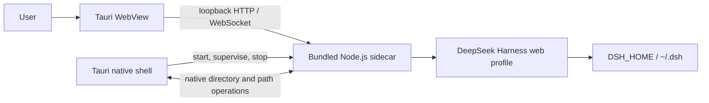

<p align="center">
  
</p>

<p align="center">
  <strong>An independent desktop distribution for DeepSeek Harness.</strong><br>
  <sub>Install and launch directly while keeping your existing configuration, sessions, plugins, and workspaces.</sub>
</p>

<p align="center">
  <a href="https://github.com/cipherTing/deepseek-harness-desktop-pure/releases/latest"><strong>Download DeepDive</strong></a>
  &nbsp;·&nbsp;
  <a href="https://github.com/cipherTing/deepseek-harness-desktop-pure/releases/latest">Release notes</a>
  &nbsp;·&nbsp;
  <a href="https://github.com/cipherTing/deepseek-harness-desktop-pure/issues">Report a Desktop issue</a>
  &nbsp;·&nbsp;
  <a href="https://github.com/deepseek-ai/deepseek-harness">DeepSeek Harness upstream</a>
</p>

<p align="center">
  <a href="https://github.com/cipherTing/deepseek-harness-desktop-pure/releases/latest"></a>
  <a href="https://github.com/cipherTing/deepseek-harness-desktop-pure/actions/workflows/build-desktop.yml"></a>
  
  <a href="LICENSE"></a>
</p>

<p align="center"><a href="README.md">简体中文</a> · English</p>

> **Independent distribution**
>
> DeepDive was formerly named DeepSeek Harness Desktop. It is now independently published as DeepDive for brand and trademark clarity. This project is not affiliated with or endorsed by DeepSeek.

## One desktop entry point, not another Harness

DeepDive packages the [DeepSeek Harness](https://github.com/deepseek-ai/deepseek-harness) Web client as macOS and Windows installers. It owns only the desktop window, bundled runtime, and required system adapters; Harness features, Web UI, plugin system, and user data remain owned by the upstream runtime.

| | |
| --- | --- |
| **Install and go** | Packages include Node.js and the Harness production runtime. Users do not need Node.js, pnpm, Rust, or other developer tooling. |
| **One set of data** | Desktop and native Web use the same `DSH_HOME`, settings, credentials, sessions, workspaces, and caches. |
| **Desktop only** | DeepDive does not add Harness features, rewrite business logic, or maintain a separate "Desktop mode." |

## Download and install

Download the latest package for your platform from [GitHub Releases](https://github.com/cipherTing/deepseek-harness-desktop-pure/releases/latest), then launch it directly after installation.

| Platform | Package | Support |
| --- | --- | --- |
| macOS | `deepdive-macos-arm64-<version>.dmg` | macOS 11 or newer, Apple Silicon only. |
| Windows | `deepdive-windows-x64-<version>.exe` | Windows x64. It uses the system Evergreen WebView2 Runtime and downloads it only when absent. |

> **First-install note:** macOS packages use ad-hoc signing and are not Apple-notarized. Windows packages do not use a commercial code-signing certificate. The operating system may show a developer or SmartScreen warning on first install; verify that the package came from this repository's GitHub Release.

## Keep using your existing Harness environment

- An existing `DSH_HOME` is inherited unchanged; otherwise Harness still resolves it as `~/.dsh`.
- `.env` files keep the existing Harness loading order; Desktop does not introduce a separate environment file.
- The sidecar uses the operating-system user home as its working directory, never a Tauri install, resource, or application-data directory.
- Desktop and native Web can read the same profiles, plugins, settings, credentials, sessions, workspaces, and caches.
- Bundled Node.js, JavaScript dependencies, and Tauri resources are application runtime files only. They never mix with Harness user data.

## How it runs

DeepDive does not rewrite the Harness backend in Rust or reimplement browser transport. Tauri launches a bundled Node.js sidecar, which starts the standard `web` profile on a random `127.0.0.1` port. The system WebView loads that local address directly. The listener binds only to loopback and is never exposed to the LAN or public Internet.



The DeepSeek Harness Web Host continues to generate the page, client-plugin bundles, `/api`, event streams, and dynamic-plugin updates. DeepDive owns only the native window, process lifecycle, installers, and required operating-system interactions.

## Where an issue belongs

| Issue | Destination |
| --- | --- |
| Installation, startup, packaging, signing, window behavior, native dialogs, or sidecar lifecycle | [This repository's Issues](https://github.com/cipherTing/deepseek-harness-desktop-pure/issues) |
| Harness features, model providers, Agent behavior, plugin system, or Web product behavior | [DeepSeek Harness Issues](https://github.com/deepseek-ai/deepseek-harness/issues) |

If a capability should also exist in the CLI, native Web, or another Harness runtime, it belongs in DeepSeek Harness instead of becoming a DeepDive-private feature.

## For maintainers

<a id="run"></a>

### Run native Web

To start the native Web client directly, follow the [DeepSeek Harness run instructions](https://github.com/deepseek-ai/deepseek-harness#run). DeepDive neither replaces nor changes that path.

<a id="run-from-source"></a>

### Develop from source

To develop Harness itself, follow the [DeepSeek Harness source instructions](https://github.com/deepseek-ai/deepseek-harness#run-from-source). To develop the Desktop shell, run these commands from the repository root:

```sh
pnpm install
pnpm desktop:dev
pnpm desktop:build
```

macOS packages can be built only on an Apple Silicon Mac, and Windows x64 packages only in a Windows x64 environment. See [AGENTS.md](AGENTS.md) for maintenance rules, incremental development commands, and release constraints.

### Versioning and releases

- [`desktop/package.json`](desktop/package.json) is the only Desktop version source. Update it with `pnpm desktop:version:set -- <version>`, then run `pnpm desktop:version:check`.
- [`desktop/UPSTREAM_COMMIT`](desktop/UPSTREAM_COMMIT) records only the upstream tag or full SHA synchronized into this fork, never this repository's HEAD.
- GitHub Actions is maintainer-triggered only; only `master` may publish `v<version>` after both platform builds succeed.
- Release notes use short Chinese and English Markdown lists that summarize user-visible changes without implementation detail.

## Contributing and license

Contributions that fix Desktop packaging, platform compatibility, Tauri integration, or the release pipeline are welcome. Read [AGENTS.md](AGENTS.md) before contributing, and keep changes minimal, complete, low-intrusion, and behavior-preserving for Harness.

This fork retains the original project's [MIT License](LICENSE). Third-party dependencies and licenses are listed in [THIRD_PARTY_NOTICES.md](THIRD_PARTY_NOTICES.md). DeepSeek names and marks remain the property of their respective owners; see [desktop/assets/README.md](desktop/assets/README.md) for the icon source and license.
