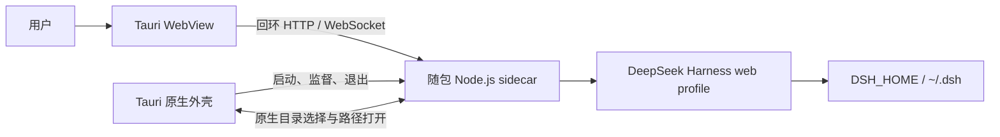

<p align="center">
  
</p>

<p align="center">
  <strong>为 DeepSeek Harness 打造的独立桌面发行版。</strong><br>
  <sub>安装即可启动，继续使用已有的配置、会话、插件和工作区。</sub>
</p>

<p align="center">
  <a href="https://github.com/cipherTing/deepseek-harness-desktop-pure/releases/latest"><strong>下载 DeepDive</strong></a>
  &nbsp;·&nbsp;
  <a href="https://github.com/cipherTing/deepseek-harness-desktop-pure/releases/latest">发行说明</a>
  &nbsp;·&nbsp;
  <a href="https://github.com/cipherTing/deepseek-harness-desktop-pure/issues">反馈 Desktop 问题</a>
  &nbsp;·&nbsp;
  <a href="https://github.com/deepseek-ai/deepseek-harness">DeepSeek Harness 上游</a>
</p>

<p align="center">
  <a href="https://github.com/cipherTing/deepseek-harness-desktop-pure/releases/latest"></a>
  <a href="https://github.com/cipherTing/deepseek-harness-desktop-pure/actions/workflows/build-desktop.yml"></a>
  
  <a href="LICENSE"></a>
</p>

<p align="center">简体中文 · <a href="README.en.md">English</a></p>

> **独立发行说明**
>
> DeepDive 原名 DeepSeek Harness Desktop。为清晰区分本项目与 DeepSeek Harness 的名称和品牌，现以 DeepDive 独立发布；本项目不隶属于、也未获 DeepSeek 背书。

## 一个桌面入口，不另造一套 Harness

DeepDive 将 [DeepSeek Harness](https://github.com/deepseek-ai/deepseek-harness) 的 Web 客户端封装为 macOS 和 Windows 安装包。它只负责桌面窗口、随包运行环境和必要的系统适配；Harness 的功能、Web 界面、插件机制和用户数据仍由上游运行时负责。

| | |
| --- | --- |
| **直接安装** | 安装包内包含 Node.js 与 Harness 的生产运行环境，不需要用户安装 Node.js、pnpm、Rust 或其他开发工具。 |
| **不分叉数据** | Desktop 与原生 Web 使用同一个 `DSH_HOME`、设置、凭据、会话、工作区和缓存。 |
| **只做 Desktop** | 不新增 Harness 功能，不改写业务逻辑，不维护一个所谓的“Desktop 模式”。 |

## 下载与安装

从 [GitHub Releases](https://github.com/cipherTing/deepseek-harness-desktop-pure/releases/latest) 下载对应平台的最新安装包，安装完成后直接启动。

| 平台 | 安装包 | 支持范围 |
| --- | --- | --- |
| macOS | `deepdive-macos-arm64-<version>.dmg` | macOS 11 或更高版本，仅 Apple Silicon。 |
| Windows | `deepdive-windows-x64-<version>.exe` | Windows x64；使用系统 Evergreen WebView2 Runtime，缺失时由安装程序联网补齐。 |

> **首次安装提醒：** macOS 包采用 ad-hoc 签名且未进行 Apple notarization，Windows 包未使用商业代码签名证书。首次安装时系统可能显示开发者或 SmartScreen 提醒；请确认下载来源是本仓库的 GitHub Release。

## 继续使用你已有的 Harness 环境

- 已设置的 `DSH_HOME` 会被原样继承；未设置时仍由 Harness 解析为 `~/.dsh`。
- `.env` 保持 Harness 原有的加载顺序，Desktop 不引入专属环境文件。
- sidecar 以系统用户主目录为工作目录，不使用 Tauri 的安装、资源或应用数据目录作为 Harness 工作目录。
- Desktop 和原生 Web 可以读取同一套 profile、插件、设置、凭据、会话、工作区和缓存。
- 随包 Node.js、JavaScript 依赖和 Tauri 资源只属于应用运行时，不会混入 Harness 的用户数据目录。

## 它如何运行

DeepDive 不把 Harness 后端重写进 Rust，也不重新实现浏览器传输。Tauri 启动随包 Node.js sidecar；sidecar 以标准 `web` profile 在随机 `127.0.0.1` 端口运行，系统 WebView 直接加载该本地地址。端口只绑定回环地址，不会暴露到局域网或公网。



DeepSeek Harness Web Host 继续生成页面、客户端插件 bundle、`/api`、事件流和动态插件更新；DeepDive 只拥有原生窗口、进程生命周期、安装包和必需的操作系统交互。

## 问题该提到哪里

| 问题 | 反馈位置 |
| --- | --- |
| 安装、启动、打包、签名、窗口行为、原生对话框、sidecar 生命周期 | [本仓库 Issues](https://github.com/cipherTing/deepseek-harness-desktop-pure/issues) |
| Harness 功能、模型提供方、Agent 行为、插件机制、Web 产品功能 | [DeepSeek Harness Issues](https://github.com/deepseek-ai/deepseek-harness/issues) |

如果一个能力应该同时存在于 CLI、原生 Web 或其他 Harness 运行方式中，它应当进入 DeepSeek Harness，而不是作为 DeepDive 的私有功能。

## 给维护者

<a id="run"></a>

### 运行原生 Web

需要直接启动原生 Web 客户端时，请使用 [DeepSeek Harness 原项目运行说明](https://github.com/deepseek-ai/deepseek-harness#run)。DeepDive 不替代或改变这条路径。

<a id="run-from-source"></a>

### 从源码开发

开发 Harness 本体时，请使用 [DeepSeek Harness 原项目从源码运行说明](https://github.com/deepseek-ai/deepseek-harness#run-from-source)。开发 Desktop 外壳则在仓库根目录执行：

```sh
pnpm install
pnpm desktop:dev
pnpm desktop:build
```

macOS 安装包只能在 Apple Silicon Mac 上构建，Windows x64 安装包只能在 Windows x64 环境构建。完整的维护规则、增量开发命令和发布约束见 [AGENTS.md](AGENTS.md)。

### 版本与发布

- [`desktop/package.json`](desktop/package.json) 是 Desktop 版本的唯一来源；使用 `pnpm desktop:version:set -- <version>` 更新版本，并用 `pnpm desktop:version:check` 校验。
- [`desktop/UPSTREAM_COMMIT`](desktop/UPSTREAM_COMMIT) 只记录本 fork 已完成同步的上游 tag 或完整 SHA，不记录本仓库 HEAD。
- GitHub Actions 仅由维护者手动触发；只有 `master` 可以在两个平台构建成功后发布 `v<version>`。
- Release 正文使用中英文的简短 Markdown 列表，只概述用户可感知的更新，不记录实现细节。

## 贡献与许可

欢迎修复 Desktop 打包、平台兼容、Tauri 适配和发布链路问题。提交前请阅读 [AGENTS.md](AGENTS.md)，并保持改动最小、完整、低侵入且不改变 Harness 行为。

本 fork 保留 DeepSeek Harness 原项目的 [MIT License](LICENSE)。第三方依赖及许可证见 [THIRD_PARTY_NOTICES.md](THIRD_PARTY_NOTICES.md)。DeepSeek 名称与标志归其各自权利人所有；图标来源与许可说明见 [desktop/assets/README.md](desktop/assets/README.md)。
