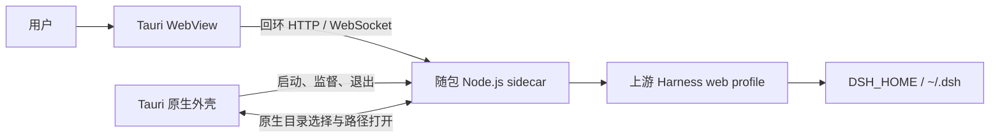

<p align="center">
  
</p>

<h1 align="center">DeepSeek Harness Desktop</h1>

<p align="center"><strong>将上游 DeepSeek Harness Web 客户端纯净封装为开箱即用的桌面应用。</strong></p>

<p align="center">简体中文 · <a href="README.en.md">English</a></p>

<p align="center">
  <a href="https://github.com/cipherTing/deepseek-harness-desktop-pure/releases/latest"></a>
  <a href="https://github.com/cipherTing/deepseek-harness-desktop-pure/actions/workflows/build-desktop.yml"></a>
  <a href="LICENSE"></a>
  
</p>

<p align="center">
  <a href="https://github.com/cipherTing/deepseek-harness-desktop-pure/releases/latest"><strong>下载最新版本</strong></a>
  · <a href="https://github.com/deepseek-ai/deepseek-harness">上游项目</a>
  · <a href="https://github.com/cipherTing/deepseek-harness-desktop-pure/issues">Desktop 问题反馈</a>
</p>

> **项目边界：本项目只做一件事，将原版 DeepSeek Harness Web 客户端打包成纯净的 Desktop 发行版。** 不新增 Harness 功能，不改变业务逻辑，不维护另一套配置、会话、工作区或用户数据，也不把上游项目改造成所谓的“Desktop 模式”。

## 项目定位

[DeepSeek Harness](https://github.com/deepseek-ai/deepseek-harness) 是本项目唯一的 Harness 功能来源。本仓库是独立的桌面发行 fork，只负责 Tauri 外壳、随包运行环境、Desktop 必需的系统适配以及 macOS/Windows 安装包发布。

| 原则 | 说明 |
| --- | --- |
| **纯净封装** | 保留上游 Web 界面、API、事件流、动态插件和 Harness 运行语义，不复制或重写 Web 功能。 |
| **零环境安装** | 安装包内携带 Node.js 和 Harness 生产运行闭包，用户无需安装 Node.js、pnpm、Rust 或其他开发环境。 |
| **同一套数据** | Desktop 与原生 Web 使用相同的 `DSH_HOME`、`~/.dsh`、`.env` 加载规则、设置、凭据、会话、工作区和缓存。 |
| **极低侵入** | Desktop 适配优先留在 `desktop/`；只有 Tauri 集成确实无法完成时，才允许对上游代码做最小且直接相关的修改。 |
| **独立发行** | Desktop 使用自己的 SemVer 版本和 GitHub Release；上游同步记录与 Desktop 版本彼此独立。 |

## 下载与安装

前往 [GitHub Releases](https://github.com/cipherTing/deepseek-harness-desktop-pure/releases/latest) 下载对应平台的最新安装包。安装完成后直接启动即可，用户不需要额外配置 Node.js 或包管理器。

| 平台 | 安装包 | 支持范围 |
| --- | --- | --- |
| macOS | `deepseek-harness-desktop-macos-arm64-<version>.dmg` | macOS 11 或更高版本，仅支持 Apple Silicon。 |
| Windows | `deepseek-harness-desktop-windows-x64-<version>.exe` | Windows x64，使用系统 Evergreen WebView2 Runtime；缺失时由安装程序联网补齐。 |

> **安装提醒：** 当前 macOS 包采用 ad-hoc 签名且未进行 Apple notarization，Windows 包也未购买商业代码签名。首次安装时系统可能显示开发者或 SmartScreen 提醒；请确认下载来源确实是本仓库的 GitHub Release。

## 运行方式

Desktop 不把 Harness 后端改写进 Rust，也不重新实现浏览器传输。Tauri 启动随包 Node.js sidecar，sidecar 以标准 `web` profile 在 `127.0.0.1` 的随机端口运行上游 Harness Web Host，系统 WebView 直接加载该地址。端口只绑定本机回环地址，不对局域网或公网开放。



这种结构让 index 注入、客户端插件 bundle、`/api`、事件流和动态插件热更新继续由上游 Web Host 按请求生成，Desktop 只承担桌面窗口、进程生命周期和必要的原生系统交互。

## 配置与数据兼容

- `DSH_HOME` 已设置时原样继承；未设置时仍由 Harness 解析为 `~/.dsh`。
- `.env` 继续按照 Harness 原有顺序加载，不增加 Desktop 专属环境文件。
- sidecar 的工作目录固定为当前系统用户主目录，不使用 Tauri 安装目录、资源目录或应用数据目录作为 Harness 工作目录。
- Desktop 与原生 Web 可以读取同一套设置、凭据、profile、会话、工作区和缓存。
- 安装包内部的 Node.js、JavaScript 依赖和 Tauri 资源只属于运行时文件，不会与 Harness 用户数据混用。

## 原生 Web 与上游源码

<a id="run"></a>

### 运行

需要直接启动原生 Web 客户端时，请使用[上游运行说明](https://github.com/deepseek-ai/deepseek-harness#run)。Desktop 不替代或改变这条启动路径。

<a id="run-from-source"></a>

### 从源码运行

需要开发 Harness 本体或使用上游源码启动时，请使用[上游从源码运行说明](https://github.com/deepseek-ai/deepseek-harness#run-from-source)。本仓库只在其基础上增加 Desktop 打包层。

## 本地开发

本仓库保留上游工程的开发方式，并额外提供两个 Desktop 根命令。Desktop CI 与正式打包固定使用 Node.js `22.23.2`、pnpm `11.7.0`、Rust `1.96.0` 和 Tauri 2。

安装依赖：

```sh
pnpm install
```

启动 Desktop 开发环境：

```sh
pnpm desktop:dev
```

构建当前平台安装包：

```sh
pnpm desktop:build
```

macOS 安装包只能在 Apple Silicon Mac 上构建，Windows x64 安装包只能在 Windows x64 环境构建。完整的维护规则、增量开发命令和发布约束见 [AGENTS.md](AGENTS.md)。

## 版本与发布

- [`desktop/package.json`](desktop/package.json) 是 Desktop 版本的唯一来源。
- 修改版本时运行 `pnpm desktop:version:set -- <version>`，并用 `pnpm desktop:version:check` 检查所有版本镜像。
- [`desktop/UPSTREAM_COMMIT`](desktop/UPSTREAM_COMMIT) 只记录本 fork 最新同步完成的上游 commit，不记录本仓库 HEAD。
- GitHub Actions 仅支持维护者手动触发；macOS 与 Windows 均构建成功后发布 `v<version>` Release。
- 上游同步不会由 CI 自动 fetch、merge 或 rebase，必须由维护者检查并手动完成。

## 问题归属

| 问题类型 | 反馈位置 |
| --- | --- |
| Desktop 安装、启动、打包、签名、原生对话框、窗口行为、sidecar 生命周期 | [本仓库 Issues](https://github.com/cipherTing/deepseek-harness-desktop-pure/issues) |
| Harness 功能、模型提供方、Agent 行为、插件机制、Web 业务功能 | [上游 DeepSeek Harness](https://github.com/deepseek-ai/deepseek-harness/issues) |

本仓库不接受与 Desktop 打包无关的新 Harness 功能。一个功能如果应该同时存在于 CLI、原生 Web 或其他 Harness 运行方式中，就应当提交到上游项目，而不是在这里增加 Desktop 私有实现。

## 贡献

欢迎修复 Desktop 打包、平台兼容、Tauri 适配和发布链路问题。提交修改前请先阅读 [AGENTS.md](AGENTS.md)，并始终以“最小完整、极低侵入、不改变上游业务”为判断标准。

维护者：[cipherTing](https://github.com/cipherTing)

## 许可证与归属

本 fork 保留上游项目的 [MIT License](LICENSE)。第三方依赖及许可证见 [THIRD_PARTY_NOTICES.md](THIRD_PARTY_NOTICES.md)。DeepSeek 名称与标志归其各自权利人所有，本项目仅使用相关标志说明所封装的上游项目；图标来源与许可说明见 [desktop/assets/README.md](desktop/assets/README.md)。
